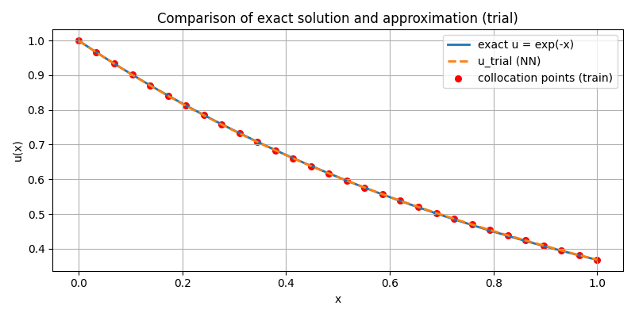

# Lagaris-type PINN for First-Order ODE

This repository contains a minimal Python implementation of a **Physics-Informed Neural Network (PINN)** for solving a first-order ordinary differential equation (ODE) using the method proposed by Lagaris, Likas, and Fotiadis in their 1998 paper.

## Problem Solved

We solve the simple first-order ODE:

$$
\frac{du}{dx} = -u, \quad u(0) = 1, \quad x \in [0, 1]
$$

Exact solution:
$$
u(x) = e^{-x}
$$

## Method Overview

The trial solution is constructed as:

$$
u_t(x) = u_0 + x \cdot N(x; \theta)
$$

where:
- $u_0 = 1$ is the initial condition,
- $N(x; \theta)$ is a small neural network with parameters $\theta$,
- The term $x$ ensures that the initial condition $u_t(0) = u_0$ is satisfied exactly for any $N$.

The network $N$ has a minimal architecture with one hidden neuron and a $\tanh$ activation:
$$
N(x) = w_2 \cdot \tanh(w_1 \cdot x + b_1) + b_2
$$

---

## Code Structure

The script is self-contained and requires only `numpy` and `matplotlib`.

Key functions:
- `forward_N(x, theta)` – computes network output \( N(x) \)
- `u_trial(x, theta)` – trial solution \( u_t(x) \)
- `du_trial_dx(x, theta)` – derivative of the trial solution
- `residuals(x, theta)` – computes PDE residual \( R(x) \)
- `loss(theta)` – mean squared residual over all collocation points
- `grads(theta, x_points)` – **analytically computed** gradient of the loss (not automatic differentiation)

---

## Results

After training (2000 epochs of gradient descent with learning rate 0.1), the neural network approximates the solution \( u(x) = e^{-x} \) with high accuracy using only **4 parameters** and **30 uniformly spaced collocation points**.

The final mean squared residual is typically below \( 10^{-5} \), and the maximum absolute error against the exact solution is of order \( 10^{-4} \).

### Output Figures
1.  
2.  

---

## References

- Lagaris, I. E., Likas, A., & Fotiadis, D. I. (1998). _Artificial Neural Networks for Solving Ordinary and Partial Differential Equations_. IEEE Transactions on Neural Networks, 9(5), 987–1000.
